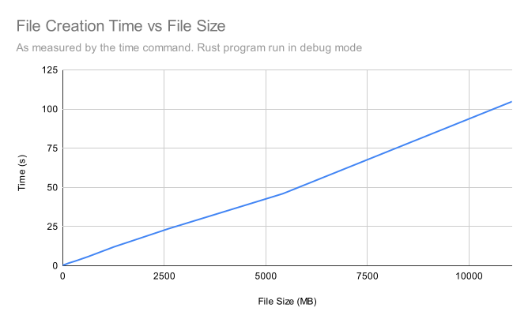
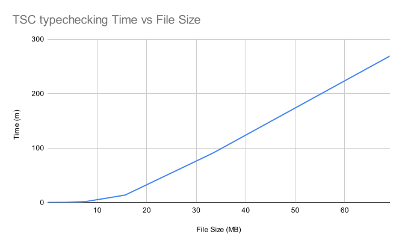
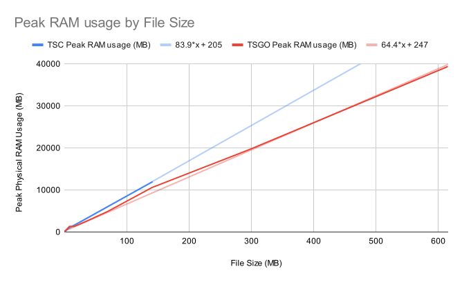

---
{
  title: 'It takes 26 yottabytes of RAM to typecheck a union of Safe Integers',
  description: "Sometimes `number` is good enough",
  published: '2025-08-21',
  tags: ['typescript', 'javascript'],
  originalLink: 'https://jacobasper.com/blog/it-takes-26-yottabytes-of-ram-to-typecheck-a-union-of-safe-integers/'
}
---
First of all, before you smelly nerds start complaining, I know this benchmark means literally nothing—I just did it for fun. I'm sure it isn't perfect, and I doubt my measurements say anything particularly important

I am aware TSGO is not released. I'd expect it to have variance in performance due potentially missing out on certain features and being new

## Criteria

### What exactly are we measuring here?

A Safe Integer is defined as JavaScript's `Number.MIN_SAFE_INTEGER` to `Number.MAX_SAFE_INTEGER` inclusive, or $$[-(2^{53} - 1), 2^{53} - 1]$$

The titular metric describes the following—if a file containing a TypeScript union of all Safe Integers were to be type checked using `tsc`, theoretically, the process would require 26 yottabytes of physical RAM

We'll go over file creation, time, RAM, and CPU for TSC and TSGO

If you'd like to skip to the pretty graphs, here's a table of contents:

- [File Creation](#file-creation)
- [Type checking time](#time)
- [Type checking RAM](#ram)
- [Type checking CPU](#cpu)

[GitHub]: https://github.com/20jasper/typescript-union-benchmarking

[Check out the Source Code for benchmarks][GitHub] if you'd like to run them yourself or see what exactly is being run

More specifics will be described as relevant

### Uhhh what is a yottabyte??????

That's 1,000,000,000,000,000,000,000,000 (1 septillion) bytes, or 1 trillion terabytes, or 1 trillion trillion bytes. I don't know about you, but I don't have that much RAM on my computer. If anyone has an extra 26 yottabytes of RAM laying around collecting dust, let me know!

### Specs

My computer has 12 logical processors and 64 GB of RAM. This test was run on WSL using Ubuntu 20.04.6 LTS and 48 GB of RAM

```
Processor	AMD Ryzen 5 5600X 6-Core Processor                3.70 GHz
Installed RAM	64.0 GB
Storage	932 GB SSD CT1000T500SSD8, 954 GB SSD SPCC M.2 PCIe SSD
Graphics Card	AMD Radeon RX 6600 (8 GB)
```

## Pretty graphs

### File Creation

I ran a Rust program that builds a string in memory then writes to the file system

[See the source code][GitHub]

The program is run in debug mode (as all good benchmarks must). Ultimately it doesn't matter since this is the least interesting bit of the benchmark

The following is example output where a union of -1..=1 is generated. File size was minimized beyond keeping statements on separate lines for legibility

<!--  prettier-ignore  -->
```typescript
type SafeInteger = -1|0|1;
const y: SafeInteger = 0;
// @ts-expect-error
const X: SafeInteger = Infinity;
```

#### File Creation Time

Time is defined as wall clock time



File creation time scales linearly with the file size. A 10 GB file takes around 100 seconds to generate. I could have gone further, but I couldn't be bothered to clear up more space on my SSD

#### File Size


File size scales logarithmically with union size. The amount of digits increases with every power of 10

If the trend line were followed until the full union of safe integers was created, it would require approximately 315 zettabytes

I found a trend line of $$\left(x\log_{10} x \cdot 16\right) + 101$$ was reasonable. A file containing a union of size 1 is 101 bytes

Plugging in the safe integer range size ($$1.80\cdot10^{16}$$) yields $$3.15\times10^{17}$$ MB, or 315 ZB

### Typechecking

#### Time

Time is defined as wall clock time


69 MB takes around 4.5 hours and 2 MB takes around 4 seconds to typecheck with TSC

I ran the TSC benchmarks until my computer gave out. I ran a benchmark for a union with around 17 million items (140 MB) and my computer restarted after around 24 hours both times. This may have been a good stopping point anyways—I'm not so dedicated that I'll not use my computer for a week+ 😅


TSGO is far faster for this very niche use case. The same 69 MB file takes around 17 seconds—almost 1000x faster! CPU was no longer the limiting factor here. I ran out of RAM once I needed more than 64 GB[^swap]

[^swap]: I know I could have used swap to get more RAM, but I'd expect this to be very slow and heavily skew the numbers. After a 3 minute typecheck, who knows how slow it would get

#### RAM

RAM is physical RAM used by the process



RAM usage scales linearly with file size. TSC has a baseline of around 170 MB, and TSGO around 65–70 MB

Now how did we get to that 26 yottabytes of RAM?

We previously calculated that [a file with a SafeInteger union would be 315 ZB](#file-creation). If we plug that into the TSC trend line of $$83.9x$$, we get $$2.64\times10^{19}$$ MB, or 26 yottabytes of RAM

TSGO would take around $$2.18\times10^{19}$$ MB, or 22 yottabytes due to its trend line of $$67.2x$$—a huge improvement!

#### CPU


TSC trends towards an average of using 100% of one logical processor, while TSGO lands around 150%

## Is there even enough storage in the world?

According to Business Wire's report on the IDC's Global StorageSphere forecast[^costsTooManyDollars], the amount of data being stored globally is expected to grow to 8.9 ZB by 2024. The `SafeInteger` union would take 315 ZB, or around 35x that number. Maybe in 20 years I'll ask everyone to pool their storage space for the sake of type safety!

[^costsTooManyDollars]: I am using Business Wire as a proxy since the actual report costs $7,500 😭

## Just Download more RAM

Back in the day, gramma tried to jailbreak their VCR, but they accidentally downloaded infinite RAM. They scrambled to hit the internet shutoff valve, but it was too late. They opened up task manager and it showed 1 yottabyte of RAM

Grandpa turned on Nord VPN to buy some time, but depleting the world's RAM supply has dire ramifications

> ERROR: NORDVPN ULTIMATE REQUIRED FOR RAM-EVADE MANEUVERS. YOU HAVE 3 MINUTES BEFORE IP LEAK

Gramma was never seen again, and their Steam account was completely wiped

Don't risk it—use an untraceable method like stealing RAM sticks from your local library, and if you need lots of RAM, yottabyte!
