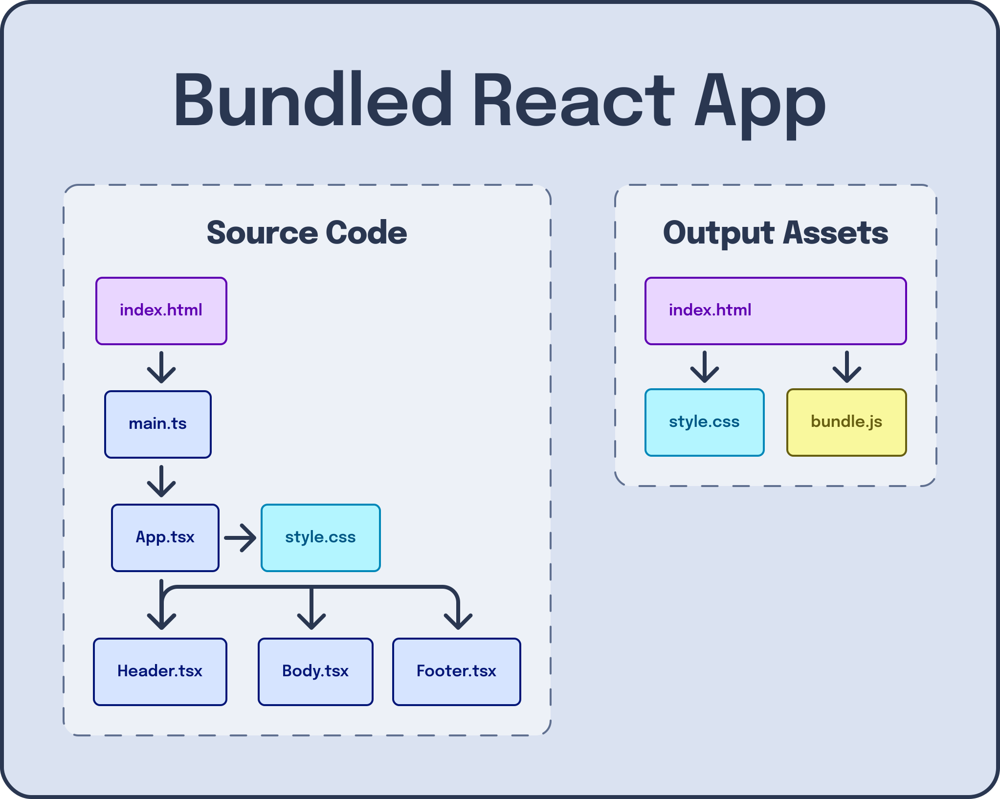
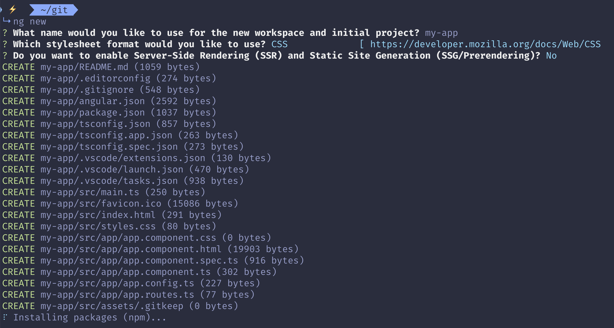
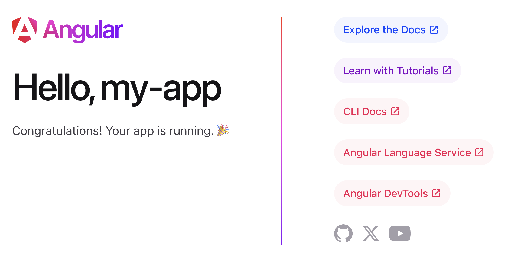
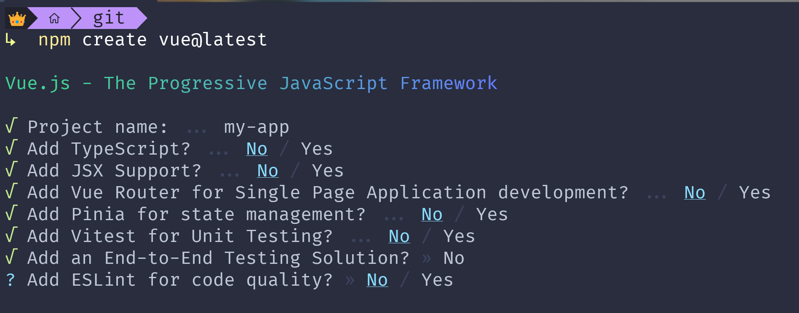
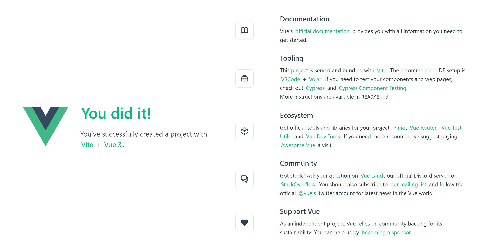

---
{
    title: "Bundling",
    description: "Bundling is the process of taking your source code and transforming it into a format that can be run in the browser. Let's learn more about it and how to apply it.",
    published: '2025-06-18T22:12:03.284Z',
    tags: ["react", "angular", "vue", "webdev"],
    order: 1
}
---

<details>
    <summary>What tools are we learning in this chapter?</summary>
There are many good options out there for bundling today:

- [Parcel](https://parceljs.org/)
- [Rspack](https://www.rspack.dev/)
- [Turbopack](https://turbo.build/pack)

While each comes with their own pros and cons, we're instead going to be focusing on [Vite](https://vite.dev/). Here's why:

- Vite is the suggested bundler for Vue apps and is maintained by many of the Vue maintainers
- Vite is used by Angular's tooling to host a development server (more on that soon)
- Vite is widely adopted by modern React applications
- The configurability of the other tools _can_ be more complex in many instances
- Due to Vite's popularity, there are a lot of learning resources out there and plugins available to you immediately
- There is an ongoing effort to migrate Vite's core ([Rollup](https://rollupjs.org/)) to Rust (under the name [Rolldown](https://rolldown.rs/)), meaning that your Vite apps will get much faster to bundle in the future

Without further ado, let's get to the meat of the chapter.

</details>

When working with websites written with nothing more than HTML, CSS, and JavaScript, it can be challenging to keep all of your code organized and consolidated.

Not sure what I mean? Let's build a small `index.html` file to demonstrate.

This `index.html` file will contain a button and a count of how many times the button was pressed:

```html
<!doctype html>
<html>
	<head>
		<meta charset="UTF-8" />
		<title>My Site</title>
	</head>
	<body>
		<p id="count">0</p>
		<button id="button">Add one</button>
	</body>
</html>
```

Naturally, this code won't function without any JavaScript, so let's add in some logic:

```html
<!doctype html>
<html>
	<head>
		<meta charset="UTF-8" />
		<title>My Site</title>
	</head>
	<body>
		<p id="count">0</p>
		<button id="button">Add one</button>
		<script>
			const buttonEl = document.querySelector("#button");
			let count = 0;
			buttonEl.addEventListener("click", () => {
				count++;
				document.querySelector("#count").textContent = count;
			});
		</script>
	</body>
</html>
```

Finally, we'll sprinkle in some styling to make it look nicer:

```html
<!doctype html>
<html>
	<head>
		<meta charset="UTF-8" />
		<title>My Site</title>
		<style>
			* {
				font-family: sans-serif;
			}

			#count {
				font-size: 3rem;
				text-align: center;
			}

			#button {
				border-radius: 99px;
				background-color: #00344d;
				color: #e5f2ff;
				border: none;
				padding: 1rem 2rem;
				font-size: 2rem;
				margin: 0 auto;
				display: block;
			}
		</style>
	</head>
	<body>
		<p id="count">0</p>
		<button id="button">Add one</button>
		<script>
			const buttonEl = document.querySelector("#button");
			let count = 0;
			buttonEl.addEventListener("click", () => {
				count++;
				document.querySelector("#count").textContent = count;
			});
		</script>
	</body>
</html>
```

<iframe data-frame-title="No Bundle - StackBlitz" src="pfp-code:./ffg-ecosystem-no-bundle-1?template=node&embed=1&file=src%2Fmain.jsx" sandbox="allow-modals allow-forms allow-popups allow-scripts allow-same-origin"></iframe>

Notice how our `index.html` file went from quickly glanceable 11 lines of code into a somewhat sprawling 40?

# Splitting files using web standards

Let's take that longer `index.html` file and break it into multiple files:

```html
<!-- index.html -->
<!doctype html>
<html>
	<head>
		<meta charset="UTF-8" />
		<title>My Site</title>
		<link rel="stylesheet" href="style.css" />
	</head>
	<body>
		<p id="count">0</p>
		<button id="button">Add one</button>
		<script src="script.js"></script>
	</body>
</html>
```

```javascript
// script.js
const buttonEl = document.querySelector("#button");
let count = 0;
buttonEl.addEventListener("click", () => {
	count++;
	document.querySelector("#count").textContent = count;
});
```

```css
/* style.css */
* {
    font-family: sans-serif;
}

#count {
    font-size: 3rem;
    text-align: center;
}

#button {
    border-radius: 99px;
    background-color: #00344d;
    color: #e5f2ff;
    border: none;
    padding: 1rem 2rem;
    font-size: 2rem;
    margin: 0 auto;
    display: block;
}
```

<iframe data-frame-title="Web Standard Imports - StackBlitz" src="pfp-code:./ffg-ecosystem-web-standard-imports-2?template=node&embed=1&file=src%2Fmain.jsx" sandbox="allow-modals allow-forms allow-popups allow-scripts allow-same-origin"></iframe>

Notice how our files are now separated by concerns? One file for templating, another for logic, and a final one for styling; all neat and organized.

----------

Now let's say that we want to use [TypeScript](https://www.typescriptlang.org/) and [SCSS](https://sass-lang.com/) (two languages that compile to JavaScript and CSS, respectively) on our website.

```scss
/* style.scss */
* {
    font-family: sans-serif;
}

#count {
    font-size: 3rem;
    text-align: center;
}

$bgColor: #00344d;
$textColor: #e5f2ff;

#button {
    border-radius: 99px;
    background-color: $bgColor;
    color: $textColor;
    border: none;
    padding: 1rem 2rem;
    font-size: 2rem;
    margin: 0 auto;
    display: block;
}
```

```typescript
// script.ts
const buttonEl = document.querySelector("#button") as HTMLButtonElement;
let count = 0;
buttonEl.addEventListener("click", () => {
	count++;
	document.querySelector("#count")!.textContent = "" + count;
});
```

We could:

1. Add the TypeScript compiler as a pre-serve step to compile down to JavaScript
2. Add the SCSS compiler as a pre-serve step to compile down to CSS
3. Link the compiled files to your `index.html` file and hope you didn't make a typo

```json
{
	"name": "your-package-json",
	"scripts": {
		"start": "tsc && sass src && servor src"
	},
	"dependencies": {
		"servor": "^4.0.2",
		"sass": "^1.75.0",
		"typescript": "^5.4.5"
	}
}
```

```json
{
	"// tsconfig.json": "",
	"compilerOptions": {
		"target": "es2016",
		"lib": ["dom"],
		"strict": true,
		"skipLibCheck": true
	},
	"include": ["src/**/*.ts"]
}
```


But by doing this, you'll lose:

- Warnings when you rename a source code file, but not the reference to that file in your `index.html`
- Hot reloading when you change the `.ts` or `.scss` file
  - You can re-introduce that, but you'll need another dependency for it
- Only compiling the related files when you modify one of them

<iframe data-frame-title="No Bundle SCSS/TS - StackBlitz" src="pfp-code:./ffg-ecosystem-no-bundle-scss-ts-3?template=node&embed=1&file=src%2Fmain.jsx" sandbox="allow-modals allow-forms allow-popups allow-scripts allow-same-origin"></iframe>


-----

Alternatively, we could use a bundler, change two lines of code in our `index.html` file, change our `"start"` script, and be done:

```html
<!-- index.html -->
<!doctype html>
<html>
	<head>
		<meta charset="UTF-8" />
		<title>My Site</title>
		<link rel="stylesheet" href="./src/style.scss" />
	</head>
	<body>
		<p id="count">0</p>
		<button id="button">Add one</button>
		<script src="./src/script.ts"></script>
	</body>
</html>
```

```json
{
	"name": "your-package-json",
	"scripts": {
		"start": "vite"
	},
	"dependencies": {
		"vite": "^5.2.8",
		"sass": "^1.75.0",
		"typescript": "^5.4.5"
	}
}
```

<iframe data-frame-title="Bundled SCSS/TS - StackBlitz" src="pfp-code:./ffg-ecosystem-bundle-scss-ts-4?template=node&embed=1&file=src%2Fmain.jsx" sandbox="allow-modals allow-forms allow-popups allow-scripts allow-same-origin"></iframe>

This barely scratches the surface of the power and convenience of what a bundler can provide you.

# What does a bundler do?

You may be asking yourself:

> What is a bundler and what can it do?

In short, a bundler is responsible for a wide array of actions that helps you manage your codebase and make it ready for others to consume.

See, among other things, a bundler is responsible for making sure that code which doesn't natively run on the browser (say, TypeScript, SCSS, and others) is transformed to the relevant transformed code which can.

Take a basic website, for example:


Here, we have an `index.html`, `style.css` and `script.js` file. These three files are able to run in the browser without any transformation, so we can upload them to our server and have people immediately consume this site.

Now let's look at a slightly larger website that uses TypeScript and SCSS:


Because TypeScript and SCSS files don't run in the browser natively, we need to first transform them into `.css` and `.js` files, which we can _then_ upload to a server.

This doesn't just apply to these tools, either. The same transformation process can be applied to React, Angular, and Vue applications alike:

<!-- ::start:tabs -->

## React



## Angular


## Vue


<!-- ::end:tabs -->


## Bundler Capabilities

While we've hinted at some of what a bundler is capable of, that's only the start. A bundler is able to do many things:

1) Compile templates from `.jsx`, `.vue` files and Angular Templates into dedicated CSS files and JavaScript instructions to run in the browser
2) Compile TypeScript to regular JavaScript so it can run in the browser
3) Translate newer JavaScript code into older JavaScript code so it can run in older browsers
   - This step is called "transpilation"
   - A common tool for transpilation is Babel
4) Automatically remove unused code from the output to make things faster and smaller
   - This step is called "Tree-shaking"
5) Merge multiple files that rely on one another into a single file so that HTTP doesn't have to make multiple round-trips to download everything
6) Optimize the code for size, making it harder for humans to read but faster to download
   - This step is called "minification"

While each of these steps may call a different tool under-the-hood, most bundlers nowadays do a good job at abstracting away those nuances for many use-cases.

As such, you typically either do not need to modify a bundler's behavior beyond a couple of configuration options, if even.

> This isn't to say that you can never modify a bundler's behavior; just be aware that when you do so, there tends to be seldom resources out there to explain what to do to fix things when they go awry. Thar be dragons. 🐉


# The Bundling Pipeline

Let's take a look at an example of a bundling pipeline for each of the frameworks we'll be looking at today.

> Keep in mind, you can customize essentially every aspect of this pipeline; this is just _an_ example, not _the_ example.

<!-- ::start:tabs -->

## React

Let's start by assuming that we have the following TypeScript-based React component:

```tsx
// App.tsx
export const App = () => {
    const message: string = "Test";
	return <p>{message}</p>
}
```

This component would likely follow a pipeline similar to the following:

![The React bundling pipeline has 5 steps. A compilation step takes us from .tsx to .jsx files and sees TypeScript compiling away its syntax. There's then another compilation step that sees Babel transform JSX syntax to function calls which moves us from .jsx to .js files. Then there's a transpilation step that sees Babel replace modern JS with equivalent older JS. Then there's minification that has the bundler rename variables and more to shorten code. Finally, we have bundling which combines multiple JS files into one.](./react_bundling_pipeline.svg)

In the first step of this pipeline, the TypeScript syntax would be removed to leave only the JSX syntax:

```jsx
// App.jsx
export const App = () => {
    const message = "Test";
    return <p>{message}</p>;
};
```

This JSX would then be converted to `createElement` vanilla JavaScript calls:

```javascript
// App.js
export const App = () => {
    const message = "Test";
    return React.createElement("p", null, message);
};
```

This might then be transformed to an older version of JavaScript where `const` isn't available but `var` is:

```javascript
// App.js (ES5)
export const App = () => {
    var message = "Test";
    return React.createElement("p", null, message);
};
```

Then, the code might be minified to shorten the code's length:

```javascript
export const App=()=>React.createElement("p",null,"Test");
```

And finally, this `App` component might be bundled with other code to create the final output of `bundle.js`.

## Angular

Let's start by assuming that we have the following Angular component:

```angular-ts
// App.ts
@Component({
	selector: "app-root",
	standalone: true,
	template: `
		<p>{{message}}</p>
	`
})
class AppComponent {
	message: string = "Test";
}
```

This component would likely follow a pipeline similar to the following:

![The Angular bundling pipeline has 5 steps. A compilation step compiles the TypeScript template into a function (which is also TypeScript). There's then another compilation step that has TypeScript compile away its syntax away from a .ts file to a .js file. Then there's a transpilation step that sees Babel replace modern JS with equivalent older JS. Then there's minification that has the bundler rename variables and more to shorten code. Finally, we have bundling which combines multiple JS files into one.](./angular_bundling_pipeline.svg)

In the first step of this pipeline, Angular compiles the template into a function that can be used at runtime.

This template of `<p>{{message}}</p>` compiles to a function that might look something like this:

```javascript
// "App.ts (fn template)"
function AppComponent_Template(rf, ctx) {
    if (rf & 1) {
      ɵɵelementStart(0, 'p');
      ɵɵtext(1);
      ɵɵelementEnd();
    }
    if (rf & 2) {
      ɵɵadvance();
      ɵɵtextInterpolate(ctx.message);
    }
}
```

> The strange `ɵɵ` symbols that prefix some of these functions denote Angular internal functions that should only ever be accessed by the compiler to generate the runtime of your program.

The rest of your TypeScript code would then be transformed into JavaScript:

```javascript
// App.js
// Your Angular `@Component` decorator is transformed to this:
ɵɵdefineComponent({
  type: AppComponent,
  selectors: [['app-root']],
  standalone: true,
  features: [ɵɵStandaloneFeature],
  decls: 2,
  vars: 1,
  template: function AppComponent_Template(rf, ctx) {
    if (rf & 1) {
      ɵɵelementStart(0, 'p');
      ɵɵtext(1);
      ɵɵelementEnd();
    }
    if (rf & 2) {
      ɵɵadvance();
      ɵɵtextInterpolate(ctx.message);
    }
  },
  encapsulation: 2,
});

class AppComponent {
	message = "Test";
}
```

This might then be transformed to an older version of JavaScript where the `class` keyword isn't available:

```javascript
// App.js (ES5)
function _typeof(o) { "@babel/helpers - typeof"; return _typeof = "function" == typeof Symbol && "symbol" == typeof Symbol.iterator ? function (o) { return typeof o; } : function (o) { return o && "function" == typeof Symbol && o.constructor === Symbol && o !== Symbol.prototype ? "symbol" : typeof o; }, _typeof(o); }
function _defineProperties(target, props) { for (var i = 0; i < props.length; i++) { var descriptor = props[i]; descriptor.enumerable = descriptor.enumerable || false; descriptor.configurable = true; if ("value" in descriptor) descriptor.writable = true; Object.defineProperty(target, _toPropertyKey(descriptor.key), descriptor); } }
function _createClass(Constructor, protoProps, staticProps) { if (protoProps) _defineProperties(Constructor.prototype, protoProps); if (staticProps) _defineProperties(Constructor, staticProps); Object.defineProperty(Constructor, "prototype", { writable: false }); return Constructor; }
function _classCallCheck(instance, Constructor) { if (!(instance instanceof Constructor)) { throw new TypeError("Cannot call a class as a function"); } }
function _defineProperty(obj, key, value) { key = _toPropertyKey(key); if (key in obj) { Object.defineProperty(obj, key, { value: value, enumerable: true, configurable: true, writable: true }); } else { obj[key] = value; } return obj; }
function _toPropertyKey(t) { var i = _toPrimitive(t, "string"); return "symbol" == _typeof(i) ? i : i + ""; }
function _toPrimitive(t, r) { if ("object" != _typeof(t) || !t) return t; var e = t[Symbol.toPrimitive]; if (void 0 !== e) { var i = e.call(t, r || "default"); if ("object" != _typeof(i)) return i; throw new TypeError("@@toPrimitive must return a primitive value."); } return ("string" === r ? String : Number)(t); }
// Your Angular `@Component` decorator is transformed to this:
ɵɵdefineComponent({
  type: AppComponent,
  selectors: [['app-root']],
  standalone: true,
  features: [ɵɵStandaloneFeature],
  decls: 2,
  vars: 1,
  template: function AppComponent_Template(rf, ctx) {
    if (rf & 1) {
      ɵɵelementStart(0, 'p');
      ɵɵtext(1);
      ɵɵelementEnd();
    }
    if (rf & 2) {
      ɵɵadvance();
      ɵɵtextInterpolate(ctx.message);
    }
  },
  encapsulation: 2
});
var AppComponent = /*#__PURE__*/_createClass(function AppComponent() {
  _classCallCheck(this, AppComponent);
  _defineProperty(this, "message", "Test");
});
```

> This code is broadly not intended to be read by an application developer. Instead, it's the output of a step known as "transpilation" that converts newer JS syntax into older JS syntax so your code can run on older browsers.

Then, the code might be minified to shorten the code's length:

```javascript
function _typeof(e){return _typeof="function"==typeof Symbol&&"symbol"==typeof Symbol.iterator?function(e){return typeof e}:function(e){return e&&"function"==typeof Symbol&&e.constructor===Symbol&&e!==Symbol.prototype?"symbol":typeof e},_typeof(e)}function _defineProperties(e,t){for(var r=0;r<t.length;r++){var o=t[r];o.enumerable=o.enumerable||!1,o.configurable=!0,"value"in o&&(o.writable=!0),Object.defineProperty(e,_toPropertyKey(o.key),o)}}function _createClass(e,t,r){return t&&_defineProperties(e.prototype,t),r&&_defineProperties(e,r),Object.defineProperty(e,"prototype",{writable:!1}),e}function _classCallCheck(e,t){if(!(e instanceof t))throw new TypeError("Cannot call a class as a function")}function _defineProperty(e,t,r){return(t=_toPropertyKey(t))in e?Object.defineProperty(e,t,{value:r,enumerable:!0,configurable:!0,writable:!0}):e[t]=r,e}function _toPropertyKey(e){var t=_toPrimitive(e,"string");return"symbol"==_typeof(t)?t:t+""}function _toPrimitive(e,t){if("object"!=_typeof(e)||!e)return e;var r=e[Symbol.toPrimitive];if(void 0!==r){var o=r.call(e,t||"default");if("object"!=_typeof(o))return o;throw new TypeError("@@toPrimitive must return a primitive value.")}return("string"===t?String:Number)(e)}ɵɵdefineComponent({type:AppComponent,selectors:[["app-root"]],standalone:!0,features:[ɵɵStandaloneFeature],decls:2,vars:1,template:function(e,t){1&e&&(ɵɵelementStart(0,"p"),ɵɵtext(1),ɵɵelementEnd()),2&e&&(ɵɵadvance(),ɵɵtextInterpolate(t.message))},encapsulation:2});var AppComponent=_createClass((function e(){_classCallCheck(this,e),_defineProperty(this,"message","Test")}));
```

And finally, this `App` component might be bundled with other code to create the final output of `bundle.js`.

## Vue

Let's start by assuming that we have the following TypeScript-based Vue component:

```vue
<!-- App.vue -->
<script setup lang="ts">
const message: string = "Test";
</script>

<template>
  <p>{{message}}</p>
</template>
```

This component would likely follow a pipeline similar to the following:

![The Vue bundling pipeline has 5 steps. A compilation step takes us from .vue to .ts files and sees Vue compile the template and script into a function. There's then another compilation step that has TypeScript compiling away its syntax, which takes us from a .ts file to a .js file. Then there's a transpilation step that sees Babel replace modern JS with equivalent older JS. Then there's minification that has the bundler rename variables and more to shorten code. Finally, we have bundling which combines multiple JS files into one.](./vue_bundling_pipeline.svg)

In the first step of this pipeline, Vue compiles the template and script into a function:

```typescript
// App.ts
import { defineComponent, toDisplayString, openBlock, createElementBlock } from "vue"
const message: string = "Test";

const sfc = defineComponent({
    __name: 'App',
    setup(_props, { expose }) {
        expose();

        return { message }
    }

});

function render(_, __, ___, setup) {
    return (openBlock(), createElementBlock("p", null, toDisplayString(setup.message)))
}

sfc.render = render
export default sfc
```

The rest of your TypeScript code would then be transformed into JavaScript:

```javascript {3}
// App.js
import { defineComponent, toDisplayString, openBlock, createElementBlock } from "vue"
const message = "Test";

const sfc = defineComponent({
    __name: 'App',
    setup(_props, { expose }) {
        expose();

        return { message }
    }

});

function render(_, __, ___, setup) {
    return (openBlock(), createElementBlock("p", null, toDisplayString(setup.message)))
}

sfc.render = render
export default sfc
```

This might then be transformed to an older version of JavaScript where `const` isn't available but `var` is:

```javascript
// App.js (ES5)
import { defineComponent, toDisplayString, openBlock, createElementBlock } from "vue";
var message = "Test";
var sfc = defineComponent({
  __name: 'App',
  setup: function setup(_props, _ref) {
    var expose = _ref.expose;
    expose();
    return {
      message: message
    };
  }
});
function render(_, __, ___, setup) {
  return openBlock(), createElementBlock("p", null, toDisplayString(setup.message));
}
sfc.render = render;
export default sfc;
```

Then, the code might be minified to shorten the code's length:

```javascript
// App.min.js
import{defineComponent,toDisplayString,openBlock,createElementBlock}from"vue";var message="Test",sfc=defineComponent({__name:"App",setup:function(e,n){return(0,n.expose)(),{message:message}}});function render(e,n,t,o){return openBlock(),createElementBlock("p",null,toDisplayString(o.message))}sfc.render=render;export default sfc;
```

And finally, this `App` component might be bundled with other code to create the final output of `bundle.js`.

<!-- ::end:tabs -->


> Notice how the bundling process doesn't inherently have to include every feature available. You could, for example, opt out of the TypeScript compilation by using JavaScript.
>
> Similarly, you can often explicitly disable specific features — like minification — by configuring your bundler to skip that step.

# Using a Bundler with a Framework

Let's take our knowledge of bundlers out of theoretical land and move onto implementing them in an app with our chosen framework.

As we mentioned at the start of the article, while there are many options for bundlers these days, we'll be using [Vite](https://vite.dev/) for its ubiquitous usage and simplicity of setup.

<!-- ::start:tabs -->

## React

To start a project with React and Vite, we'll use the `create-vite` NPM package to configure Vite with a plugin to support React's JSX syntax. This can be run via the `npm create` command:

```shell
npm create vite@latest
```

This will start an interactive setup process. Let's go through it together:

1) First, give Vite your project name:


2) Select "React" as your framework:


3) This will then give you an option to use TypeScript or JavaScript. For our purposes, select "JavaScript":


> Curious about what TypeScript is? It's an addition to JavaScript that allows you to add "compile-time types" to your code.
>
> Confused? [I wrote an article that explains what that means here](/posts/introduction-to-typescript).

> You may select SWC if you'd like here as well. It's an alternative to Vite's default ESBuild which handles much of the JavaScript source code transformation we've outlined previously in this chapter. 
>
> [SWC claims to be faster at transforming JavaScript than ESBuild](https://swc.rs/docs/benchmarks), but be aware that any potential errors caused during transformation may be harder to debug as it's less commonly used.

Once you've selected your flavor of JavaScript, you'll see a screen like the following:


5. Run the commands listed:

```shell
cd [your-project-name]
npm install
npm run dev
```

6. Finally, if all worked, you can run `npm start` to see this template screen of the generated template running and being bundled:


Now when you modify `src/App.jsx` (or `src/App.tsx` if you selected TypeScript) it will refresh the screen for you and preview your changes immediately.

> This auto-refresh on code change is called "HMR" or "Hot Module Reloading"

<iframe data-frame-title="React Build - StackBlitz" src="pfp-code:./ffg-ecosystem-react-build-5?template=node&embed=1&file=src%2Fmain.jsx" sandbox="allow-modals allow-forms allow-popups allow-scripts allow-same-origin"></iframe>

## Angular

Angular, being an "everything, including the kitchen sink" framework, has an official solution to the bundling solution.

This solution can be found in the shape of [the Angular CLI](https://angular.io/cli), which uses [Vite](https://vite.dev/) (and Vite's dependency, [ESBuild](https://esbuild.github.io/)) under-the-hood.

------

To spin up a new project, let's start by installing the Angular CLI globally:

```shell
npm i -g @angular/cli
```

This will provide us with the `ng` command globally, which we can use with the `new` subcommand to start a fresh project:

```shell
ng new
```

This will prompt you for a project name:


Then, it will ask if you want to use an extension of CSS, like Sass or Less, that can provide additional features to CSS but still compile down to it. For our needs, let's pick "CSS":


Finally, it will ask you if you'd like to use Server-Side Rendering (SSR) or Static Site Generation (SSG). We'll learn more about what those are in future chapters, but for now type "N" for no and hit "Enter":


This will then start the project generation from the built-in template:



Finally, you can start the project with:

```shell
cd my-app
npm start
```

To see a link that opens the template from the source code in the template:



Now, by modifying the source code in `src`, you're able to see the browser contents update live as you make changes.

<iframe data-frame-title="Angular Build - StackBlitz" src="pfp-code:./ffg-ecosystem-angular-build-5?template=node&embed=1&file=src%2Fmain.ts" sandbox="allow-modals allow-forms allow-popups allow-scripts allow-same-origin"></iframe>

## Vue

To spin up a fresh Vue project, you have two options:

- The [`create-vite`](https://vite.dev/guide/#scaffolding-your-first-vite-project) NPM package
- The [`create-vue`](https://github.com/vuejs/create-vue) NPM package

The while we've been using something akin to the more minimal output from `create-vite` in the first book, the official recommendation for spinning up a new Vue project is _actually_ the `create-vue` package, as it includes more built-in functionality that most production apps can leverage.

To get started with `create-vue`, execute the command via `npm create`:

```shell
npm create vue@latest
```

This will prompt you for a project name:


This will then begin a series of prompts for specific features you might want in your Vue app:



These options may not be clear at this time, but rest assured that we'll touch on what each of these options means throughout the course of this book.

For now, we'll select "No" to each. Once this is done, we'll see instructions to run the freshly generated template in our browser:

```shell
cd my-app
npm install
npm run dev
```

This should spit out a URL you can access to see the preview:



<iframe data-frame-title="Vue Build - StackBlitz" src="pfp-code:./ffg-ecosystem-vue-build-5?template=node&embed=1&file=src%2Fmain.js" sandbox="allow-modals allow-forms allow-popups allow-scripts allow-same-origin"></iframe>

<!-- ::end:tabs -->

